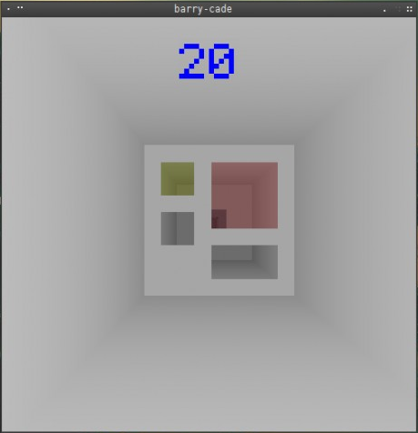

# barry-cade

### Written in 48 hours for [Ludum Dare] 26 (Minimalism)

This is my first Ludum Dare, although stressful it has definitely been an enjoyable learning experience. "barry-cade" (I normally sneak a character called Barry into my games) is a basic constant scrolling avoid the obstacles thingamabob. 

I hope people like it... *looks nervous* 

This game requires Java or OpenJDK 1.6+ to run...

### Dependencies (Not included)

* [LWJGL2]
* [slick-util]
* [progaurd] *(optional)*

Please amend the post scripts as needed.

### Download

All the needful can be found at [barrycade.flob.io]

### Screenshot

---

## License

Copyright (c) 2013 Robert Calvert ([robert.calvert.io])

See the license file for license rights and limitations (GPLv2).

[Ludum Dare]:http://ludumdare.calvert.io
[barrycade.flob.io]:http://barrycade.flob.io

[LWJGL2]:http://www.lwjgl.org
[slick-util]:http://slick.ninjacave.com
[progaurd]:http://proguard.sourceforge.net
[robert.calvert.io]:http://robert.calvert.io

